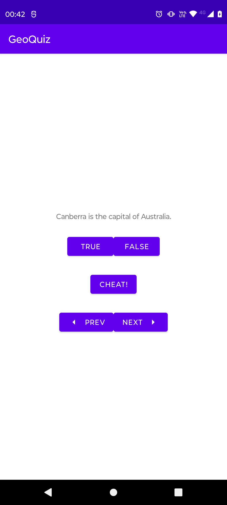
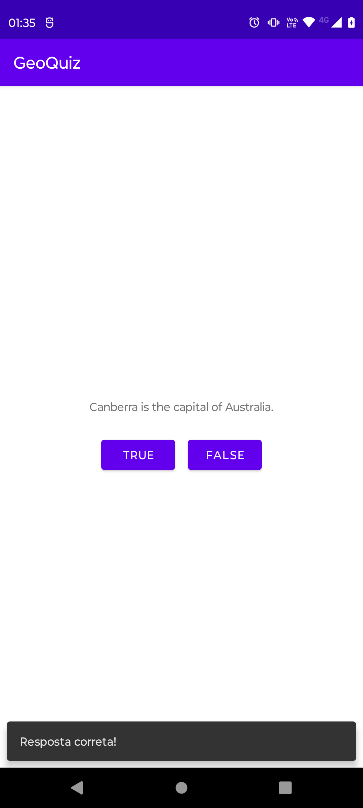
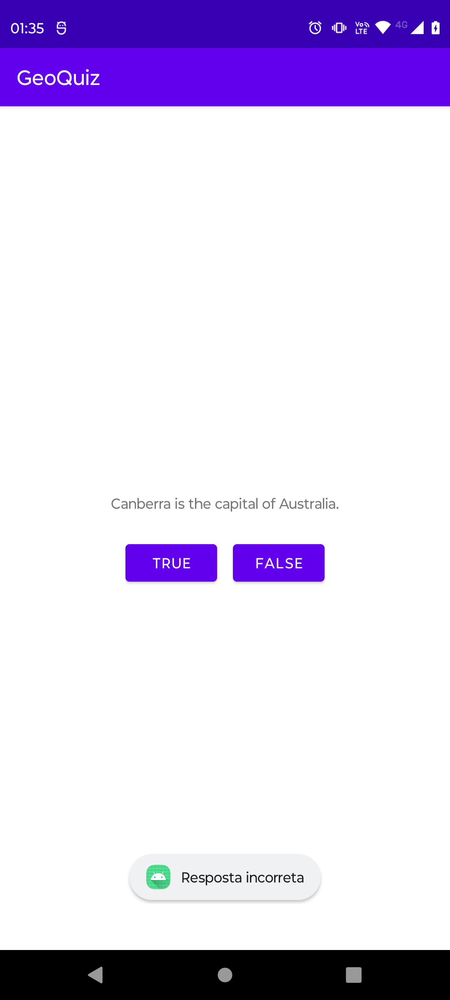

<h1 align="center">GeoQuiz</h1>

   
  

  

⭐ Esse é um projeto para demonstrar meu conhecimento técnico no desenvolvimento Android nativo com Kotlin. Mais informações técnicas abaixo.

Esse foi meu primeiro projeto na minha carreira como dev android, que comecou em meados de 2017. Foi feito quando eu estava no primeiro período da faculdade e visa mostrar a diferenca entre o Snackbar e o Toast.

 

